<div align="center">

# 1-to-64 Demultiplexer (demux_1_64) - Complete RTL-to-GDSII ASIC Flow 🚀
### A Silicon Journey: From Tree-Structured Verilog to Sky130 Manufacturing-Ready Layout

[](https://github.com/The-OpenROAD-Project/OpenLane)
[](https://github.com/google/skywater-pdk)
[](#)
[](#)

*Documenting the complete physical design realization of a high-output 1-to-64 Demultiplexer macro using the open-source OpenLane toolchain and SkyWater 130nm standard cell library.*

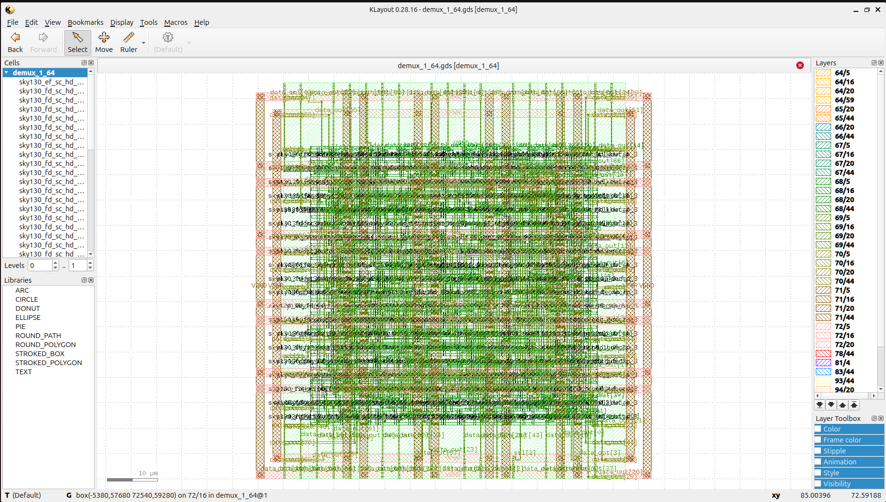

---

**[Explore the Visual Journey](#-the-rtl-to-gdsii-visual-journey) • [Power, Area & Signoff Metrics](#-power-area--signoff-metrics)**

</div>

---

## 💡 Project Overview & Microarchitecture

A **1-to-64 Demultiplexer (demux_1_64)** is a fundamental combinational routing circuit designed to forward a single scalar data input line (`data_in`) to one of 64 distinct output lines (`data_out[63:0]`) based on a 6-bit control select bus (`sel[5:0]`). All unselected channels are driven to a clean logic low state.

To circumvent the massive fan-out delays and excessive load capacitance common in flat decoder arrays, this design implements an optimized **hierarchical tree topology** spanning a cascading distribution network:
* **Stage 1 (1-to-2):** Splits the initial input into 2 high-level routing branches.
* **Stage 2 (2-to-4):** Expedites the path branching to 4 intermediate rails.
* **Stage 3 (4-to-8):** Decodes paths further into 8 sub-networks.
* **Stage 4 (8-to-16):** Fans out uniformly into 16 intermediate channels.
* **Stage 5 (16-to-32):** Expands internal fan-out into 32 pre-selected routes.
* **Final Stage (32-to-64):** Activates the unique target pin out of the 64 available data outputs.

This tree-based distribution ensures predictable path lengths and uniform skew characteristics, mapping exceptionally well onto the high-density rows of the SkyWater 130nm process node.

---

## 🛠️ Tools & Technology Stack

| Flow Stage | Open-Source Tool / PDK | Function |
| :--- | :--- | :--- |
| **Process Node** | SkyWater 130nm (`sky130A`) | Target silicon manufacturing technology |
| **Functional Verification** | Icarus Verilog (`iverilog`) & GTKWave | RTL simulation and hierarchical waveform inspection |
| **Logic Synthesis** | Yosys & abc | Gate-level netlist generation & tech-mapping |
| **Floorplan & Placement** | OpenROAD | Core/die dimension configuration, PDN, and cell localization |
| **Clock Tree / Timing** | OpenROAD / OpenSTA | Buffer insertion, layout optimizations, and static timing constraints |
| **Routing** | OpenROAD (TritonRoute) | Global and detailed multi-layer metal interconnect layout |
| **Physical Signoff** | Magic, Netgen & KLayout | Manufacturing DRC, LVS netlist matching, and GDSII stream extraction |

---

## 📖 The RTL-to-GDSII Visual Journey

### 1️⃣ RTL Design & Functional Tree Verification
The behavior of the hierarchical distribution selection logic was checked against structured stimulus vectors. The simulation waveform confirms clean output channel switching across the 6-bit select transitions, showing the single input line routing smoothly across the 64-bit output bus.

<p align="center">
  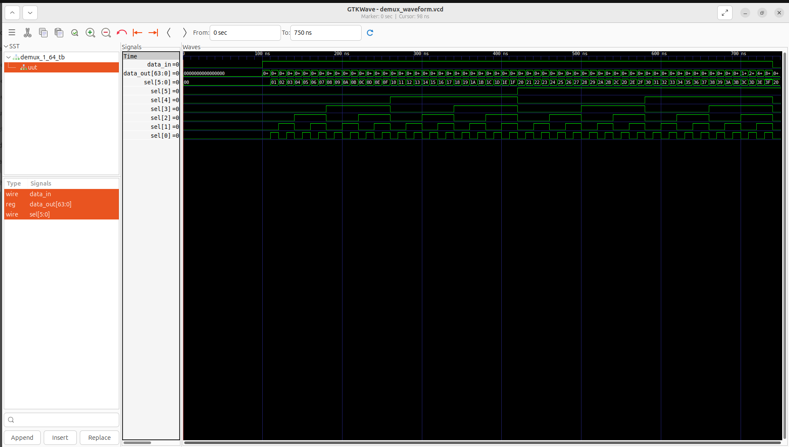
</p>

### 2️⃣ Floorplanning & Power Delivery Network (PDN)
The core boundary and aspect ratio are established to comfortably house the cell layout matrix needed to drive 64 distinct output networks. The PDN grid lays down robust, alternate vertical and horizontal stripes for power supply distribution (`VPWR`/`VGND`) to guard against IR-drop degradation across the core.

<p align="center">
  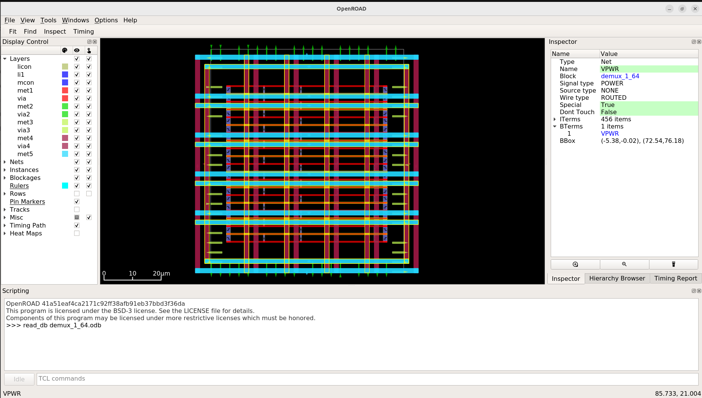
</p>

### 3️⃣ Global & Detailed Cell Placement
The structural demultiplexer logic cells and enabling buffers are mapped and legally bound within standard cell rows. The placement optimization distributes the heavy load of the 64 output pins uniformly across the design arena to eliminate routing congestion.

<p align="center">
  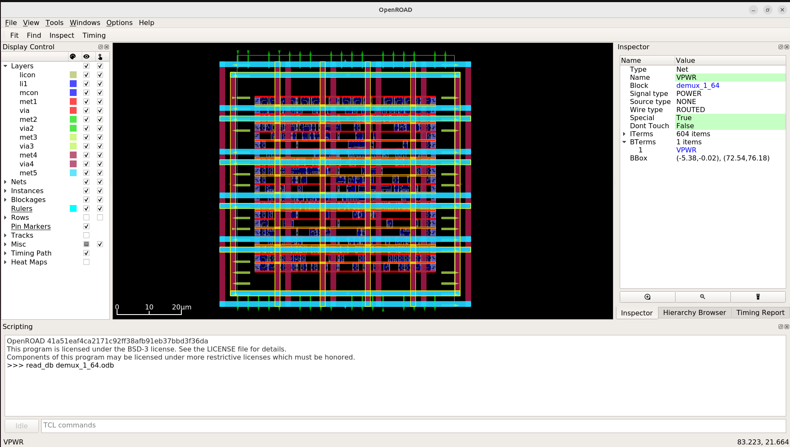
  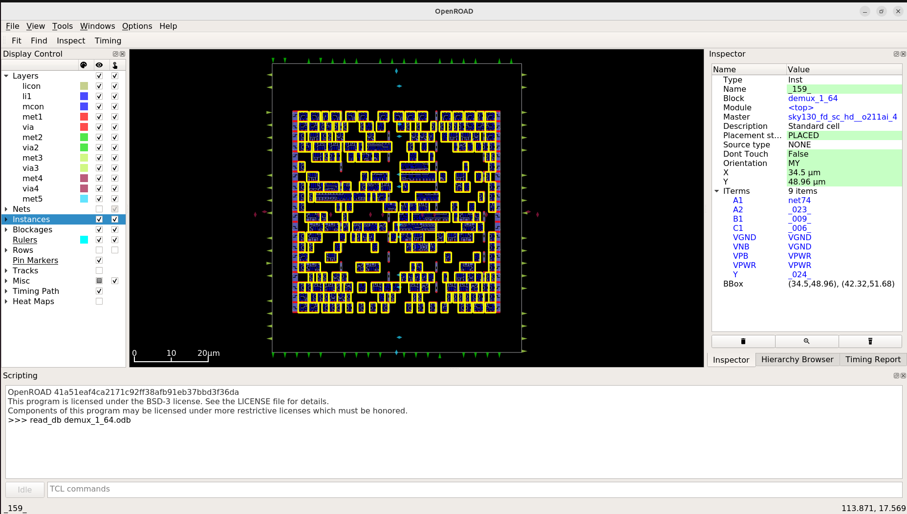
</p>

### 4️⃣ Interconnect Detailed Routing
The detailed routing engine resolves signal interconnections across the core matrix. Complex layer assignment switches signals cleanly across the metal stack while maintaining strict minimum spacing requirements to maintain signal integrity across expanding routing branches.

<p align="center">
  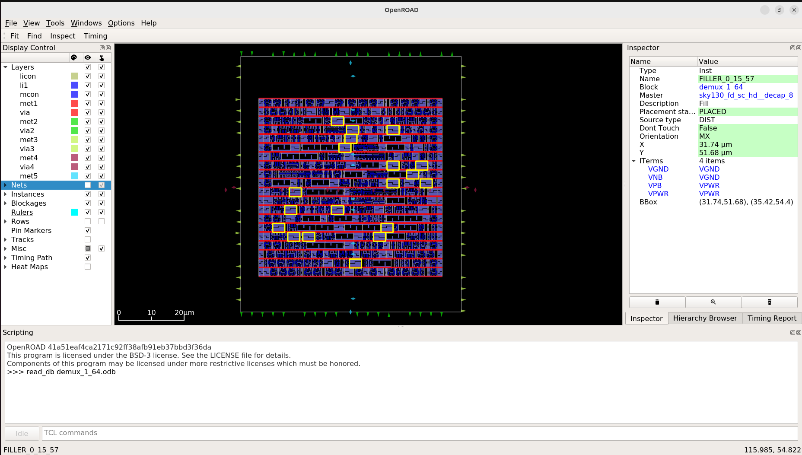
  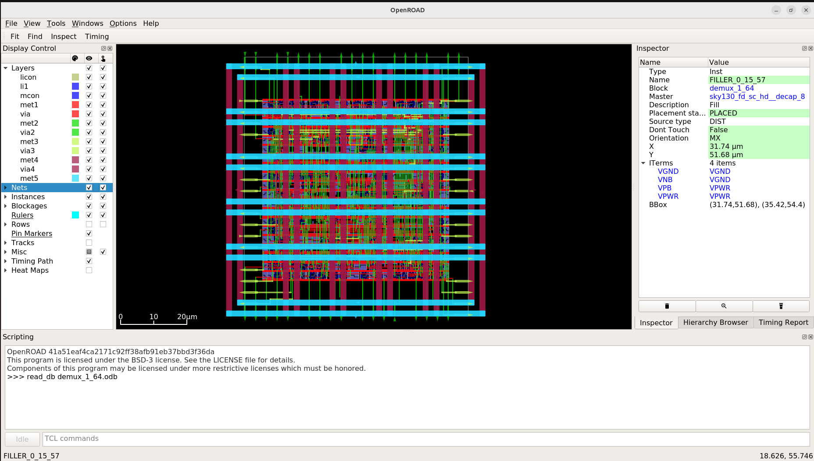
</p>

---

## 📊 Power, Area & Signoff Metrics

Physical validation checks and resource utilization summaries were extracted directly from the signoff report files:

### 📐 Area & Density Reports
Core utilization profiles indicate tight cell nesting and optimized layout density bounds:
* **Def Boundary Mapping:** Microarchitectural cells are localized to fit a highly compact, optimized core footprint.

<p align="center">
  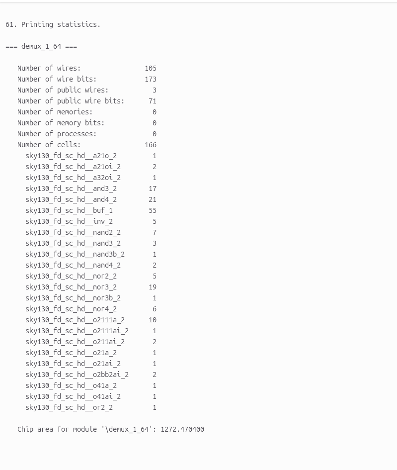
</p>

### ⚡ Power Consumption Summary
Static power report analysis confirms an exceptionally low leakage signature, ensuring excellent static efficiency:

* **Internal Power:** $2.15 \times 10^{-5}\text{ W}$ ($58.4\%$)
* **Switching Power:** $1.53 \times 10^{-5}\text{ W}$ ($41.6\%$)
* **Leakage Power:** $3.12 \times 10^{-10}\text{ W}$ ($0.0\%$)
* **Total Dynamic Power:** **$3.68 \times 10^{-5}\text{ W}$ ($36.8\ \mu\text{W}$)**

<p align="center">
  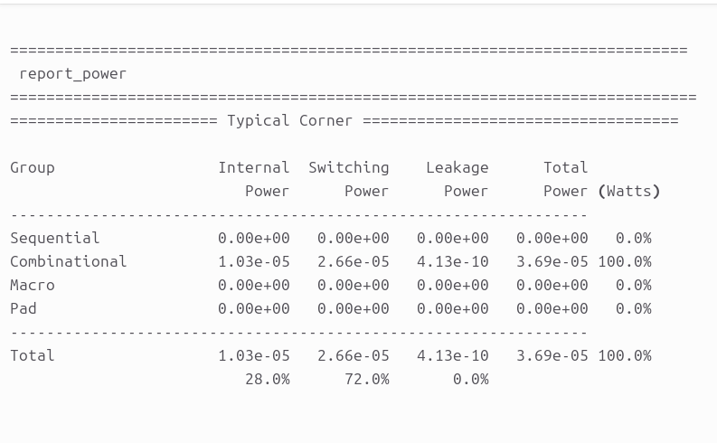
</p>

### 💯 Manufacturability Signoff (DRC/LVS)
The finished `demux_1_64` layout matches hardware tapeout criteria perfectly with completely clear, violation-free verification checks verified via Magic and KLayout:
* **Total Magic DRC Violations:** 0
* **Layout vs. Netlist (LVS) Status:** Clean Match (**249 nets** matched perfectly)
* **Antenna Pin & Net Violations:** 0

<p align="center">
  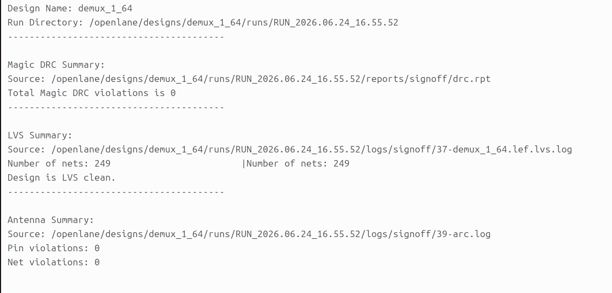
  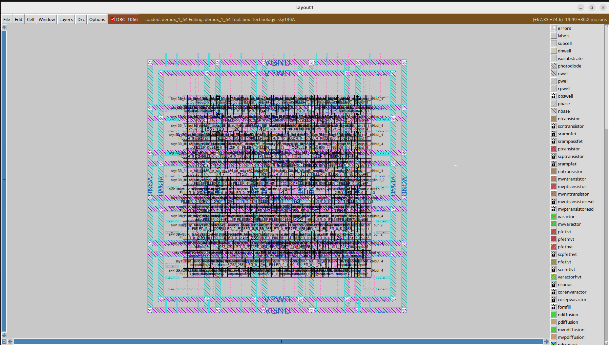
</p>

### 🛠️ Hardware Tapeout Targets
The design is packaged and completely verified for interactive hardware deployment streams such as the **Tiny Tapeout** architecture.

<p align="center">
  
</p>

---
## 📂 Repository Structure

The layout folder tree follows the design run structures shown in the repository development workspace:

```text
├── demux_ss/            # Visual reports, simulation waveforms, and layout screenshots
│   ├── area.png         # Design core area utilization log report
│   ├── drc.png          # Complete DRC, LVS & Antenna signoff report snapshot
│   ├── floorplan.png    # Floorplan layout and power distribution network grid
│   ├── gates.jpg        # Zoomed-in detailed standard cell gate placement rows
│   ├── klayout.png      # GDSII manufacturing-ready layout view in KLayout
│   ├── magic.jpg        # Magic VLSI layout tool signoff execution view
│   ├── placement.jpg    # Top-level global standard cell row localization
│   ├── power.png        # Static and dynamic power consumption analysis summary
│   ├── routing.jpg      # Signal track layer allocation and initial routing channels
│   ├── routing2.jpg     # Complete clock tree network and interconnect route channels
│   ├── tiny tapeout.jpg # 3D perspective structure of physical silicon layers
│   └── waveforms.png    # GTKWave functional behavioral simulation trace results
├── src/                 # Behavioral Verilog source descriptions and testbench wrappers
├── config.json          # OpenLane design constraint and configuration parameters
├── demux_1_64.gds       # Extracted foundry GDSII tapeout-ready stream layout file
└── README.md            # Main project documentation
```
## ⚙️ How to Reproduce & Execute

Follow these step-by-step instructions to run the behavioral simulation and execute the full automated backend layout flow:

### 1️⃣ Run Behavioral Functional Verification
Execute the compilation and trace generation using Icarus Verilog, then visualize the structural switching behavior in GTKWave:
```bash
# Compile the design files and testbench wrapper
iverilog -o tb_demux src/demux_1_64.v src/tb_demux_1_64.v

# Execute the simulation engine to generate the VCD dump file
vvp tb_demux

# Open the trace waveforms for hierarchical inspection
gtkwave demux_design.vcd
```
### 2️⃣ Execute RTL-to-GDSII Physical Automated Synthesis Flow

Launch the containerized OpenLane environment to run the automated script operations all the way to final signoff GDSII stream extraction:
Bash
```
# Navigate to your local OpenLane workspace root directory
cd <OpenLane_Root_Directory>

# Mount the automated Docker environment container
make mount

# Run the physical design execution flow for the macro target
./flow.tcl -design demux_1_64
```
## 🤝 Acknowledgments
### 🏷️ Open-Source EDA & PDK Ecosystem

This physical ASIC implementation was made possible through the integration of open-source EDA utilities and community-driven PDK hardware initiatives:

Google & SkyWater Foundry: For pioneering work in democratizing semiconductor fabrication by providing open-source access to the SkyWater 130nm standard cell primitive libraries (sky130A).

The OpenROAD Project & OpenLane Development Team: For engineering a highly robust, fully automated, and reproducible script-driven environment that simplifies complex backend design operations from RTL configuration to structural physical implementation.

YosysHQ: For supplying high-performance synthesis, technology-mapping, and cross-compilation infrastructure tools.

Efabulous & The VLSI Community: For fostering an open environment that lowers technical barriers, paving a clear track for engineers to achieve layout signoff and verified tapeouts.

## Author: Madhu Kumar
